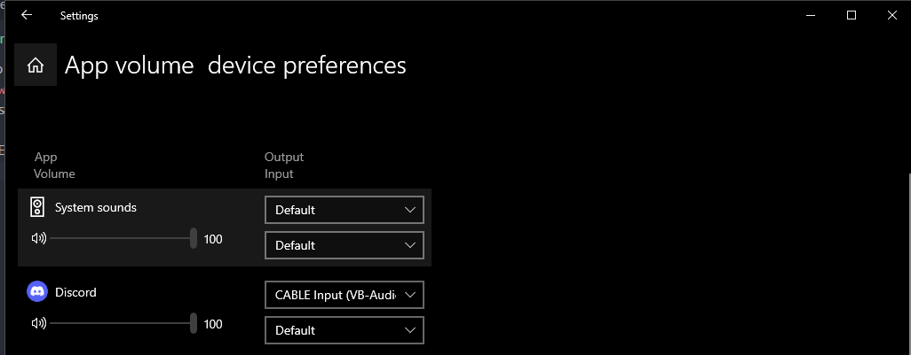
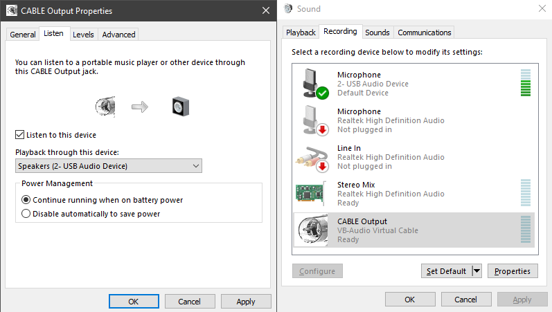
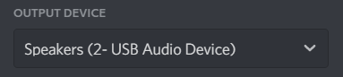

# How to use
## Setting up VAC
* Install Virtual Audio Cable (VAC)
* Go to Windows Sound mixer and output device for Discord to CABLE INPUT

* Go to Control Panel Sound options
	* Recording Tab
	* CABLE Output Properties
	* Listen Tab
	* Enable "Listen to this device"
	* Choose your main headphones/speaker from the dropdown
	
* Set your main output device in Discord Voice/Video Settings

Now all notifications, and other sounds (including the soundboard) will go through VAC to your speakers, but voice channel sounds will go directly to the device you set in Discord User settings

## Install The Plugin
* Copy the soundboard.plugin.js file to the plugins folder
* Go into plugins settings, set input device to CABLE Output

Sound clips can only be added in form of discord links.

Upload your audio anywhere in discord, right click copy link then add it in the plugin settings.

The soundboard button can be found near the noise cancellation button. (no icon yet)

UI is kinda bad but it works